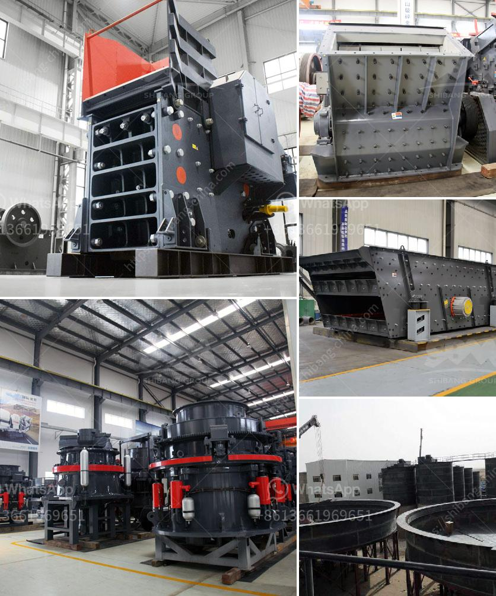

<h3>what crusher types are used in copper processing in zambia?</h3>
Copper is one of the most widely used metals in the world today. Its applications range from electrical wiring in buildings and vehicles to various consumer products and industrial machinery. As a result, the copper mining industry remains a vital contributor to the global economy.

Copper processing involves extracting copper from ore deposits and converting them into usable products such as copper cathodes, copper concentrates, and copper alloys. The main techniques used in copper processing include crushing, grinding, froth flotation, and concentration. Some commonly used crushers in copper processing are jaw crushers, cone crushers, gyratory crushers, and roll crushers.

Jaw crushers are known for their ability to break down hard and abrasive ores. This type of crusher is preferred in copper processing's primary crushing stage due to its reliable and efficient performance. A jaw crusher has a fixed jaw and a moving jaw that pivots around a complex elliptical curve. It compresses and crushes the ore against the fixed or stationary jaw.

Cone crushers are designed for secondary or tertiary crushing purposes. They are popular in the copper processing industry for their high productivity and low operating costs. A cone crusher consists of an eccentrically rotating main shaft and a mantle, which is a crushing chamber lined with a concave bowl. The ore is crushed between the mantle and the concave bowl as the main shaft gyrates.

Gyratory crushers are often used in primary crushing stages in copper processing plants. These crushers have a conical crushing head that moves in a circular pattern, crushing the ore against a static concave. Compared to jaw and cone crushers, gyratory crushers are capable of processing larger capacities and reducing the size of run-of-mine or primary crushed ore more effectively.

Roll crushers are commonly used in the last stage of the crushing process in copper processing. They compress the feed material between two rotating cylinders, breaking it into smaller fragments. Roll crushers are efficient in reducing the size of ore particles and producing a relatively uniform product size distribution. They are often used to produce fine-grained copper concentrates.

In Zambia, the copper industry has been a major contributor to economic growth and job creation. Copper processing plants in Zambia often use a combination of crushing, grinding, and froth flotation techniques. The crushers chosen for the pre-crushing stage in copper processing include jaw crushers and gyratory crushers. The cone crusher is used for secondary and tertiary crushing.

To ensure efficient and reliable copper processing in Zambia, the government and mining companies have invested in modern equipment and infrastructure. This includes crushers that are capable of processing large volumes of ore and maintaining high levels of productivity. Crushers in copper processing plants are also equipped with advanced technologies such as automation systems and online monitoring systems to enhance operational efficiency and minimize downtime.

In conclusion, various types of crushers are used in copper processing in Zambia, depending on the specific requirements of the copper deposit and the desired end products. Jaw crushers, cone crushers, gyratory crushers, and roll crushers are commonly used to crush and reduce the size of copper ores. These crushers play a crucial role in the efficient extraction and processing of copper, contributing to the growth of the copper industry in Zambia and worldwide.
<h3>Contact us</h3><ul><li><strong>Whatsapp:&nbsp;<a href="https://wa.me/8613661969651">+8613661969651</a></strong></li><li><a href="https://swt.shibang-china.com/?git&amp;zhl&amp;what crusher types are used in copper processing in zambia"><strong>Online Service(chat now)</strong></a></li></ul><h3>Related</h3><ul><li><a href='What type of crusher is used to crush copper ore.md'>What type of crusher is used to crush copper ore?</a></li><li><a href='what is concentration of ores？.md'>what is concentration of ores？</a></li><li><a href='What is the difference between a quarry and a mine.md'>What is the difference between a quarry and a mine?</a></li><li><a href='What is a grinding ball mill aid.md'>What is a grinding ball mill aid?</a></li><li><a href='What equipment to extract iron ore.md'>What equipment to extract iron ore?</a></li></ul>