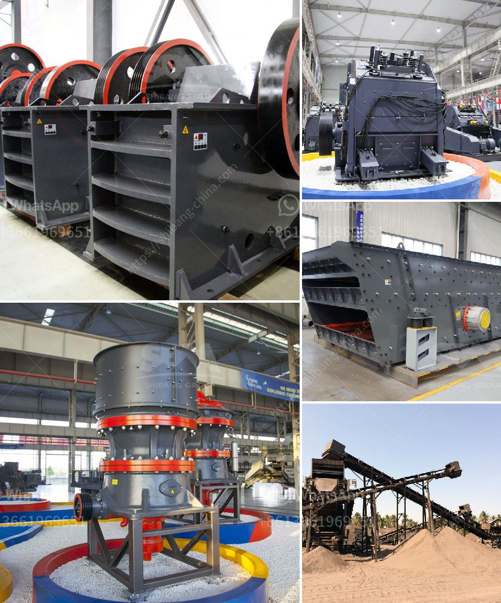

<h3>what does a vibrating feeder do?</h3>
A vibrating feeder is a crucial device in various industries including mining, metallurgy, chemical, power generation, food processing, cement, and construction. It performs a critical role in the transportation and control of bulk materials by evenly delivering a continuous stream of materials to processing or conveying equipment.

The primary function of a vibrating feeder is to move the material in a controlled and even manner. It accomplishes this by utilizing vibrations to transport materials along a conveyor belt or to a downstream machine. These vibrations move the material in a forward direction while also spreading it out evenly across the width of the feeder.

One of the key benefits of using a vibrating feeder is its ability to handle a wide range of materials, from fine powders to large, heavy chunks. The feeder's strong vibrations ensure that even sticky and difficult materials are easily transported. Additionally, the vibrating action of the feeder helps to break up any clumps or agglomerations, ensuring a consistent flow of material.

The design of a vibrating feeder is crucial as it determines its performance and functionality. A typical vibrating feeder consists of a deck, which vibrates in a controlled manner, and a trough that connects to a power source. The deck is mounted on springs, allowing it to vibrate freely and efficiently move the material along.

Vibrating feeders are available in various types to suit different applications. The most common types include electromagnetic feeders, electromechanical feeders, and grizzly feeders.

Electromagnetic feeders utilize an electromagnetic drive system that creates vibrations, allowing them to move materials. They are ideal for high-capacity applications and can be easily controlled for precise material flow.

Electromechanical feeders, on the other hand, use a mechanical drive system that consists of a motor and eccentric weights. This drive system generates vibrations that move the material. Electromechanical feeders are preferred for heavy-duty applications where higher forces are required.

Grizzly feeders are designed to separate and scalp materials before they enter the primary crusher. These feeders contain a series of bars or grizzly sections that vibrate, helping to remove any undersized or unwanted material. Grizzly feeders are commonly used in the mining and construction industries.

The advantages of using a vibrating feeder are numerous. Firstly, it ensures a constant and controlled flow of material, preventing clogging and optimizing downstream equipment performance. This is particularly important for industries that rely on accurate dosing or require consistent material supply.

Secondly, vibrating feeders improve the safety of the production process by reducing the risk of manual handling. By automating the material transportation, human exposure to hazardous substances or heavy loads is minimized.

Lastly, a vibrating feeder can enhance the overall efficiency of the production line. By evenly spreading the material across the width of the feeder, it maximizes the utilization of downstream machinery and reduces the occurrence of process bottlenecks.

In conclusion, a vibrating feeder plays a vital role in numerous industries by evenly transporting and controlling the flow of bulk materials. It effectively ensures a continuous material stream and optimizes the performance of downstream equipment. Designed to handle a wide range of materials, vibrating feeders are versatile, efficient, and contribute to a safer and more productive production environment.
<h3>Contact us</h3><ul><li><strong>Whatsapp:&nbsp;<a href="https://wa.me/8613661969651">+8613661969651</a></strong></li><li><a href="https://swt.shibang-china.com/?git&amp;zhl&amp;what does a vibrating feeder do"><strong>Online Service(chat now)</strong></a></li></ul><h3>Related</h3><ul><li><a href='Which industries depend on coal.md'>Which industries depend on coal?</a></li><li><a href='What does 20 mm all in aggregate mean.md'>What does "20 mm all in aggregate" mean?</a></li><li><a href='What equipment is needed for perlite ore mines.md'>What equipment is needed for perlite ore mines?</a></li><li><a href='what are some of the equipments used in mining industry.md'>what are some of the equipments used in mining industry?</a></li><li><a href='What are the wearing parts of grinding mill .md'>What are the wearing parts of grinding mill ?</a></li></ul>