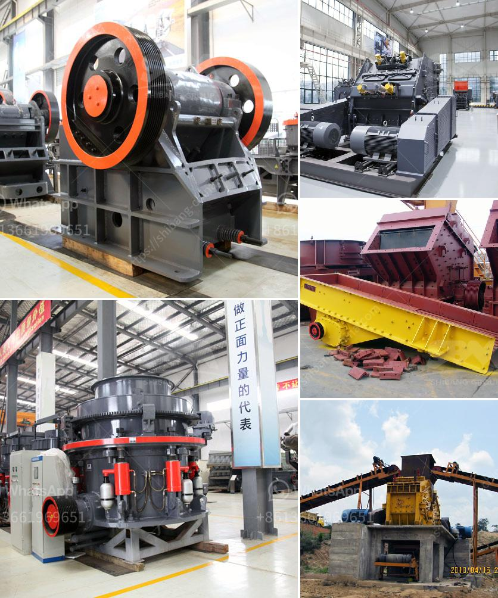

<h3>what equipment and machinery needed for mining marble and granite?</h3>
Mining marble and granite requires specialized equipment and machinery. In order to succeed in the mining industry, you must possess a combination of high-quality machinery and reliable equipment. To help you with your endeavors, I have compiled a list of essential equipment and machinery needed for mining marble and granite.

Firstly, you need to establish a comprehensive mining plan. This plan should include the extraction method, the quarry layout, the drilling and cutting process, and the handling and transportation of the extracted stones. Creating an efficient mining plan will ensure smooth operations and maximize productivity.

To extract the marble and granite from the quarry, you will need a variety of tools and machinery. The most essential equipment is a diamond wire saw, which uses diamond beads threaded onto a wire to cut through the stone. This equipment is highly efficient and provides precise cuts, allowing for a more controlled extraction process. It is important to choose a high-quality diamond wire saw that can withstand the rigors of the mining operation.

Another key piece of equipment is the drilling machine. This machine is used to create holes in the rock so that explosives can be inserted for controlled blasting. A pneumatic drill or hydraulic drill is commonly used in this process. These drills are efficient, powerful, and capable of penetrating the hard marble and granite surfaces.

Once the stones are extracted, they need to be processed and shaped according to the desired dimensions. A multi-wire saw machine is often employed for this purpose. This machine utilizes multiple diamond wires to cut the extracted blocks into slabs or smaller pieces. The precision and speed offered by multi-wire saw machines make them an indispensable part of the mining process.

To handle and transport the extracted marble and granite, heavy equipment is required. Front-end loaders or excavators are commonly used to load the stone blocks onto trucks for transportation. These machines have significant lifting capacity and can handle the weight of large stone blocks.

During the mining process, it is essential to ensure the safety of the workers. Thus, personal protective equipment (PPE) such as helmets, gloves, goggles, and safety boots should be provided to all workers. Additionally, ground support equipment such as scaffolding and safety nets should be implemented to prevent accidents and ensure a safe working environment.

In conclusion, mining marble and granite requires specialized equipment and machinery to ensure efficient and safe operations. From diamond wire saws and drilling machinery to multi-wire saw machines and heavy equipment for transportation, these tools are essential for successful mining ventures. Moreover, prioritizing safety by providing the necessary PPE and implementing ground support equipment is crucial for the well-being of the workforce. By investing in the appropriate tools and machinery, mining operations can maximize productivity and ensure the extraction of high-quality marble and granite.
<h3>Contact us</h3><ul><li><strong>Whatsapp:&nbsp;<a href="https://wa.me/8613661969651">+8613661969651</a></strong></li><li><a href="https://swt.shibang-china.com/?git&amp;zhl&amp;what equipment and machinery needed for mining marble and granite"><strong>Online Service(chat now)</strong></a></li></ul><h3>Related</h3><ul><li><a href='What is the wattage of the stone crusher.md'>What is the wattage of the stone crusher?</a></li><li><a href='What are factors that will affect the output of a cement mill.md'>What are factors that will affect the output of a cement mill?</a></li><li><a href='What is the process of sandstone mining？.md'>What is the process of sandstone mining？</a></li><li><a href='What is the price of the mobile crusher that has a capacity of 350 tons per hour.md'>What is the price of the mobile crusher that has a capacity of 350 tons per hour?</a></li><li><a href='What is the most popular rock crusher on market.md'>What is the most popular rock crusher on market?</a></li></ul>