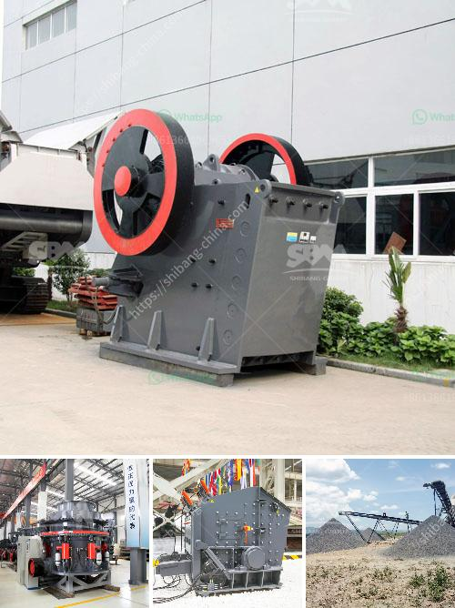

<h3>what equipment is used when mining zinc ore?</h3>
When it comes to mining zinc ore, the equipment used can vary depending on the type of deposit and the mining method employed. Nonetheless, there are several common pieces of equipment used for zinc mining that should be highlighted.

Firstly, excavation and drilling machinery are commonly used to extract the zinc ore from the underground or open-pit mines. In underground mining, specialized machines such as shaft excavators, raise borers, and continuous miners are used to excavate and bring the zinc ore to the surface. These machines are equipped with various cutting tools and hydraulic systems that enable the efficient extraction of ore.

In open-pit mining, larger equipment, such as draglines, stripping shovels, and bucket wheel excavators, is utilized. These machines can remove large amounts of overburden, or the material covering the zinc ore, to expose the deposit beneath. This method is often employed when the zinc ore is located close to the surface, and it allows for efficient extraction on a vast scale.

Once the zinc ore is brought to the surface, several additional pieces of equipment are required to process it into usable, marketable form. These include crushers, screens, flotation cells, and filters. In the crushing stage, the ore is broken down into smaller pieces using crushers. This is traditionally done using jaw crushers, cone crushers, or gyratory crushers, which can reduce the ore size to a manageable level.

After crushing, the ore undergoes a series of processes to separate the valuable zinc-bearing minerals from the gangue, or unwanted materials. This is typically achieved through flotation, a process that involves adding chemicals and frothers to create bubbles that attach to the zinc minerals, allowing them to be separated from the other minerals. In flotation cells, the valuable minerals are collected and concentrated, while the remaining waste materials, or tailings, are discarded.

Filtration equipment is then used to remove any remaining water or moisture from the concentrate, creating a dry zinc product. This is achieved through processes such as vacuum filtration or pressure filtration. The filtered concentrate can then be further processed and refined to meet the desired product specifications.

In addition to these primary pieces of equipment, ancillary machinery such as conveyors, pumps, and generators are also used in zinc mining operations. These ensure the smooth and efficient transportation of the ore and the provision of power for the various processes involved.

Overall, the equipment used in mining zinc ore is diverse and essential for extracting and processing this valuable metal. From excavation and drilling machinery to crushers, flotation cells, and filtration equipment, each plays a crucial role in the journey from underground or open-pit mines to the final zinc product ready for market. With constant technological advancements, the mining industry continues to refine and improve these equipment options, ensuring safer and more efficient zinc mining operations.
<h3>Contact us</h3><ul><li><strong>Whatsapp:&nbsp;<a href="https://wa.me/8613661969651">+8613661969651</a></strong></li><li><a href="https://swt.shibang-china.com/?git&amp;zhl&amp;what equipment is used when mining zinc ore"><strong>Online Service(chat now)</strong></a></li></ul><h3>Related</h3><ul><li><a href='What equipment is needed for phosphorite ore mines.md'>What equipment is needed for phosphorite ore mines?</a></li><li><a href='What are the ponent of nigerian mining industry.md'>What are the ponent of nigerian mining industry?</a></li><li><a href='What equipment is needed for silicon ore mines.md'>What equipment is needed for silicon ore mines?</a></li><li><a href='What is the aggregate crusher.md'>What is the aggregate crusher?</a></li><li><a href='What is the difference between a quarry and a mine.md'>What is the difference between a quarry and a mine?</a></li></ul>