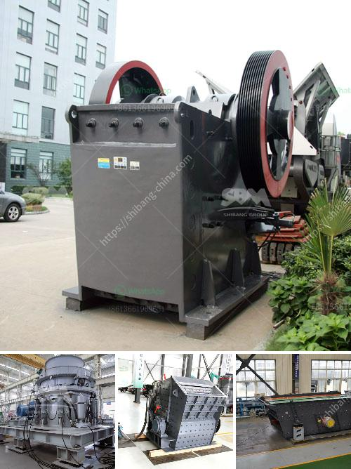

<h3>what equipment needed for mining iron ore</h3>
Mining iron ore is a complex process that requires significant equipment investments to extract the iron ore from the earth. Mining iron ore begins at ground level and requires heavy-duty equipment such as dump trucks, excavators, and drilling rigs to extract and transport the ore.

The first step in mining iron ore is drilling holes into the ground and inserting explosive charges to break up the rock. This requires powerful drilling rigs that can penetrate deep into the earth's crust. These rigs are equipped with diamond-tipped bits that can withstand the immense pressure and heat generated during the drilling process.

Once the holes are drilled, explosives are inserted and detonated to create a blast. The blast breaks up the rock, releasing the iron ore. After the blast, trucks with a capacity of several hundred tons are used to transport the broken ore to the surface for further processing.

Excavators are an integral part of the mining process as they are used to load the ore onto the trucks. These large machines have a bucket attached to a hydraulic arm that scoops up the ore and transfers it into the trucks. The size of the excavator and its bucket capacity depend on the scale of the mining operation.

Dump trucks are used to transport the ore from the mine to the processing plant. These trucks are specifically designed to carry heavy loads and travel over rough terrain. They have large beds that can hold several hundred tons of ore, ensuring efficient transport from the mine to the processing facility.

At the processing plant, the ore undergoes several stages of crushing, grinding, and washing to remove impurities and separate the iron ore from other minerals. These processes require specialized equipment such as crushers, pulverizers, and magnetic separators.

Crushers are used to break down the large chunks of ore into smaller pieces that can be easily handled and processed. Pulverizers further grind the ore into a fine powder, increasing its surface area for efficient extraction. Magnetic separators are then used to separate the iron ore from other minerals based on its magnetic properties.

In addition to the above-mentioned equipment, various auxiliary machines are also needed to support the mining operation. These include water pumps to remove excess water from the mine, ventilation systems to provide fresh air to the workers underground, and safety equipment such as helmets, masks, and protective clothing.

Overall, mining iron ore requires a range of equipment to extract and process the ore efficiently. This includes drilling rigs, excavators, dump trucks, crushers, pulverizers, magnetic separators, water pumps, ventilation systems, and safety equipment. Each piece of equipment plays a crucial role in the mining process, ensuring the extraction of iron ore in a safe and efficient manner.
<h3>Contact us</h3><ul><li><strong>Whatsapp:&nbsp;<a href="https://wa.me/8613661969651">+8613661969651</a></strong></li><li><a href="https://swt.shibang-china.com/?git&amp;zhl&amp;what equipment needed for mining iron ore"><strong>Online Service(chat now)</strong></a></li></ul><h3>Related</h3><ul><li><a href='What is belt conveyor in gold mining.md'>What is belt conveyor in gold mining?</a></li><li><a href='What is a bentonite grinding unit.md'>What is a bentonite grinding unit?</a></li><li><a href='What is the size of the coal after it passes through the crusher.md'>What is the size of the coal after it passes through the crusher?</a></li><li><a href='Which industries depend on coal.md'>Which industries depend on coal?</a></li><li><a href='What are grinding and crushing in small scale miners.md'>What are grinding and crushing in small scale miners?</a></li></ul>