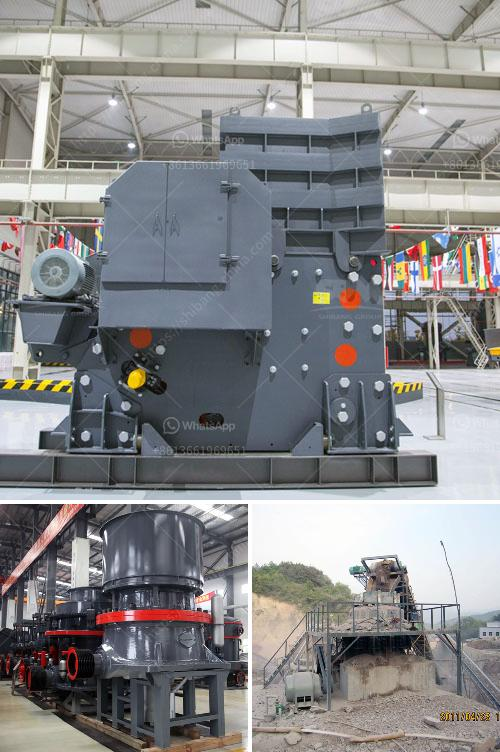

<h3>what is alluvial gold mining?</h3>
Alluvial gold mining is a mining process that extracts gold from sedimentary deposits in rivers, streams, and shallow bodies of water. Gold is typically found in small quantities within the alluvial deposits, making it an attractive and lucrative prospect for individuals with minimal mining experience.

The process of alluvial gold mining involves washing and sifting through sand, gravel, and rocks to extract the valuable gold particles. The extracted gold can then be refined further to obtain pure gold bullion that can be sold to collectors, jewelers, and investors.

Historically, alluvial gold mining has been practiced around the world for centuries. The allure of alluvial gold was responsible for the population booms in gold rush towns such as California's famous Gold Rush in the mid-1800s. Today, alluvial gold mining remains a popular choice for prospectors due to its relatively low entry barrier and the potential for significant profits.

To start alluvial gold mining, one must obtain the necessary equipment and tools, which typically consist of a gold pan, sieve, jaw crushers, and water pumps. These tools are used to dig and wash the sedimentary deposits to retrieve the gold particles. Miners immerse their gold pans in the water, allowing the heavier gold particles to sink to the bottom, while lighter materials such as sand and gravel are washed away.

The success of alluvial gold mining largely depends on the location of the deposit. Prospectors seek areas near rivers and streams where gold is likely to accumulate due to the natural process of erosion. Over time, the force of flowing water wears away rocks and minerals, carrying the heavier gold particles downstream and depositing them in low-lying areas.

Alluvial gold mining can have a positive impact on local economies and communities. In some areas, the discovery of alluvial gold deposits has led to the development of small-scale mining communities, creating job opportunities and stimulating economic growth. Additionally, revenue generated from the sale of gold can contribute to infrastructure development, education, and healthcare initiatives in these areas.

However, alluvial gold mining also has its challenges and risks. The extraction process can be physically demanding and time-consuming, requiring patience and persistence. Moreover, these mining operations can have an adverse impact on the environment. Sediments and pollutants released during the mining process can contaminate nearby water bodies, affecting aquatic life and ecosystems. Therefore, it is crucial for miners to adopt responsible and sustainable mining practices to minimize their environmental footprint.

In conclusion, alluvial gold mining is a process that extracts gold from sedimentary deposits in rivers and streams. It has played a significant role in shaping the history of gold rushes around the world and continues to be pursued by individuals for its potential profitability. However, it is important to conduct these mining operations responsibly to minimize environmental damage.
<h3>Contact us</h3><ul><li><strong>Whatsapp:&nbsp;<a href="https://wa.me/8613661969651">+8613661969651</a></strong></li><li><a href="https://swt.shibang-china.com/?git&amp;zhl&amp;what is alluvial gold mining"><strong>Online Service(chat now)</strong></a></li></ul><h3>Related</h3><ul><li><a href='What machine need to be used for rock mining industry.md'>What machine need to be used for rock mining industry?</a></li><li><a href='What machine is used to crush copper ore.md'>What machine is used to crush copper ore?</a></li><li><a href='What type of mining is used for magnetite.md'>What type of mining is used for magnetite?</a></li><li><a href='What is a cone crusher and what stones are it mainly used to crush.md'>What is a cone crusher and what stones are it mainly used to crush?</a></li><li><a href='What equipment is needed for phosphorite ore mines.md'>What equipment is needed for phosphorite ore mines?</a></li></ul>