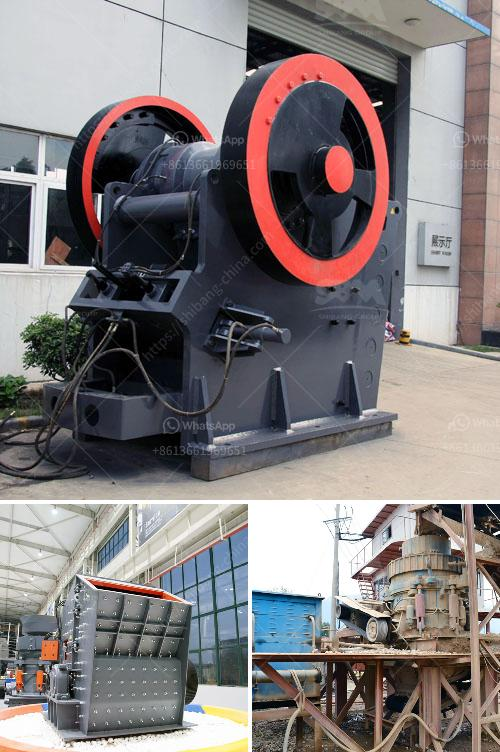

<h3>what is concentration of ores？</h3>
The concentration of ores refers to the process of removing impurities like gangue minerals, which are non-valuable materials, from extracted ore. This process increases the value of the ore by enhancing its percentage of valuable minerals and metals. Various methods can be employed to achieve ore concentration, including physical separation techniques and chemical processes.

The concentration of ores plays a vital role in mining operations as it allows for the extraction of precious minerals and metals, which are crucial components in various industries. Ores are naturally occurring rocks or minerals that contain economically valuable materials. However, these valuable materials are often mixed with impurities, making it necessary to concentrate and purify the ore before it can be used.

There are two main types of ores: oxide ores and sulfide ores. Oxide ores, which contain oxides of metals like iron, aluminum, and manganese, can be concentrated through gravitational methods like jigging, tabling, and heavy media separation. These processes take advantage of differences in specific gravity to separate the valuable minerals from the gangue.

On the other hand, sulfide ores, which contain metals like copper, lead, zinc, and nickel, are commonly concentrated through the froth flotation method. Froth flotation involves the use of reagents that selectively bind to the valuable minerals, allowing them to float while the gangue sinks. This method relies on the differences in the surface properties of minerals and is an effective way to extract valuable metals from complex sulfide ores.

Apart from physical separation techniques, chemical processes are also used to concentrate ores. One such method is leaching, which involves the use of chemicals to extract minerals from the ore. In leaching, the ore is ground and mixed with a leaching agent that selectively dissolves the valuable minerals. The resulting solution, called a leachate, is then separated from the remaining solids, which now contain a higher concentration of valuable minerals.

Another chemical process used in ore concentration is smelting, which involves heating the ore to extreme temperatures to separate the valuable metals from the impurities. Smelting is commonly used for ores that contain metals like copper, iron, and lead. During smelting, the ore is mixed with fluxes and fuel in a furnace, resulting in the formation of a molten metal. The impurities react with the fluxes and form a slag, which can be skimmed off, leaving behind a pure metal.

The concentration of ores is a crucial step in the mining industry as it directly impacts the profitability of a mining operation. By removing impurities and increasing the concentration of valuable minerals, it allows for the extraction of metals and minerals that are essential for numerous applications. Moreover, ore concentration also helps minimize the environmental impact of mining by reducing the volume of waste materials that need to be disposed of.

In conclusion, the concentration of ores is a vital process in the mining industry that involves removing impurities and enhancing the value of extracted ores. This is typically achieved through physical separation techniques like gravity separation and froth flotation, as well as chemical processes like leaching and smelting. By concentrating ores, valuable minerals and metals can be efficiently extracted, contributing to various industries and ensuring the responsible use of natural resources.
<h3>Contact us</h3><ul><li><strong>Whatsapp:&nbsp;<a href="https://wa.me/8613661969651">+8613661969651</a></strong></li><li><a href="https://swt.shibang-china.com/?git&amp;zhl&amp;what is concentration of ores？"><strong>Online Service(chat now)</strong></a></li></ul><h3>Related</h3><ul><li><a href='What is the specification of a jaw crusher.md'>What is the specification of a jaw crusher?</a></li><li><a href='what is the running cost for a jaw crusher.md'>what is the running cost for a jaw crusher?</a></li><li><a href='What is a recycle feed hopper sand mine.md'>What is a recycle feed hopper sand mine?</a></li><li><a href='What is the beneficiation of iron ore.md'>What is the beneficiation of iron ore?</a></li><li><a href='What is a cement grinding unit and what processes are involved .md'>What is a cement grinding unit and what processes are involved ?</a></li></ul>