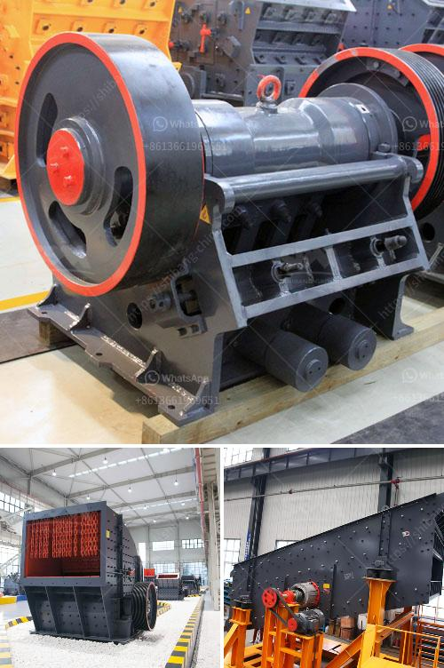

<h3>what is the best method for beneficiation of limonite</h3>
Limonite, a common iron oxide mineral, often forms as a result of weathering processes on iron-rich rocks and minerals. However, its extensive and profitable utilization poses a challenge due to its inherent low iron content and complex mineralogical composition. Beneficiation, a process that aims to upgrade the iron content and remove impurities, is crucial in unlocking the economic potential of limonite. In this article, we will explore the best methods for limonite beneficiation.

Magnetic separation is a widely used and effective technique to separate the magnetic properties of iron-bearing minerals from non-magnetic gangue minerals present in limonite ores. By utilizing differences in magnetism, it is possible to achieve a significant upgrade in the iron content of limonite. This method involves passing the crushed and finely ground limonite ore through low-intensity magnetic separators, where magnetic particles are attracted to the magnetic drum's surface while non-magnetic particles pass through. Subsequently, high-intensity magnetic separators can further refine the concentrate, producing a high-grade concentrate suitable for iron production.

Advantages: Magnetic separation is a relatively simple and cost-effective method that does not require extensive chemical reagents. It has high selectivity for iron-bearing minerals and can yield a high-quality concentrate.

Disadvantages: The economic viability of magnetic separation can be limited by the complexity of the mineralogical composition of limonite ores, particularly when they contain non-magnetic impurities. Additionally, the requirement for finely ground ores may increase energy consumption during the beneficiation process.

Flotation is another commonly used method for limonite beneficiation. By employing surface chemistry principles, flotation can effectively separate the finely ground limonite from gangue minerals based on their differing wetting properties. During flotation, ore pulp is mixed with various reagents, including collectors, frothers, and modifiers, to selectively render limonite particles hydrophobic while ensuring gangue minerals remain hydrophilic. The resultant hydrophobic particles attach to air bubbles, forming froth that can be skimmed off, whereas hydrophilic particles sink to the bottom, separating the iron-bearing minerals.

Advantages: Flotation offers excellent separation selectivity, making it suitable for complex limonite ores containing multiple mineral phases. It can produce a high-grade concentrate, and recent advancements in flotation reagent technologies have enhanced its efficiency and effectiveness.

Disadvantages: Flotation can be a highly complex process, requiring precise control of various parameters such as reagent dosage, pulp pH, and flotation time. Some challenges include the presence of slime coatings on mineral surfaces, potential issues with environmental impact due to the use of chemicals, and the cost associated with reagents.

Both magnetic separation and flotation methods have proven to be effective in the beneficiation of limonite ores. However, the selection of the most suitable method depends on several factors, including the ore's mineralogical characteristics, associated impurities, and economic considerations. Often, a combination of these methods or the integration of other processes such as gravity separation and leaching may be required to maximize the recovery of iron from limonite. Continuous research and development efforts are critical in advancing these beneficiation techniques and unlocking the economic potential of limonite deposits globally.
<h3>Contact us</h3><ul><li><strong>Whatsapp:&nbsp;<a href="https://wa.me/8613661969651">+8613661969651</a></strong></li><li><a href="https://swt.shibang-china.com/?git&amp;zhl&amp;what is the best method for beneficiation of limonite"><strong>Online Service(chat now)</strong></a></li></ul><h3>Related</h3><ul><li><a href='What kind of crushing machinery is used for sandstone processing ？.md'>What kind of crushing machinery is used for sandstone processing ？</a></li><li><a href='What is the optimum frequency for a vibrating screen.md'>What is the optimum frequency for a vibrating screen?</a></li><li><a href='What is the role of crushing in the beneficiation process.md'>What is the role of crushing in the beneficiation process?</a></li><li><a href='What machine can crush small stones into sand？.md'>What machine can crush small stones into sand？</a></li><li><a href='what equipment is used when mining zinc ore.md'>what equipment is used when mining zinc ore?</a></li></ul>