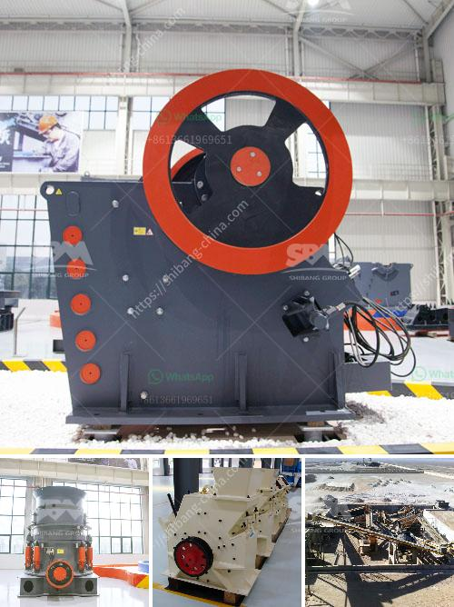

<h3>what is the difference between river sand and crusher sand</h3>
Sand is a naturally occurring granular material composed of finely divided rock and mineral particles. It is defined by size, being finer than gravel and coarser than silt. Sand can also refer to a textural class of soil or soil type; i.e., a soil containing more than 85% sand-sized particles by mass.

River sand, as the name suggests, is obtained from river banks. It is usually a whitish-gray color and has a coarser texture compared to crusher sand. The grains of river sand are rounded and smooth, making it an excellent choice for construction materials such as concrete and masonry work.

On the other hand, crusher sand, also known as manufactured sand, is produced by crushing stones into fine aggregates. This sand is an alternative to river sand and is typically used for construction purposes.

One of the main differences between river sand and crusher sand is the presence of organic substances. River sand comes from natural sources, while crusher sand is manufactured by crushing rocks and stones. Organic substances are naturally present in river sand, such as seashells and other decomposed marine life. These organic materials may affect the durability and strength of the construction material when used for concrete, as they can lead to the formation of voids or weak points.

Another significant distinction between the two types of sand is the particle shape. River sand has rounded grains, which provide better workability and mixability in concrete. The rounded grains also reduce the chances of air pockets or voids in the concrete, resulting in higher strength and durability.

In contrast, crusher sand has a more angular and sharp-edged particle shape due to the crushing process. The rough surfaces of the particles create more resistance between them, making it less workable and flowable in concrete mixtures. This can lead to a higher water demand and weaker strength in the final product. However, the angular shape of crusher sand particles can provide better interlocking, thus enhancing the overall stability and load-bearing capacity of certain construction applications.

When it comes to price, river sand is generally more expensive than crusher sand. This is mainly because river sand extraction involves various environmental regulations and permits, making it a limited resource in many regions. In contrast, crusher sand can be produced in large quantities through a controlled process, resulting in more economical pricing.

However, the scarcity and rising costs of river sand in recent years have led to a widespread shift towards the use of crusher sand in construction projects. With proper processing and quality control measures, crusher sand can be an effective substitute for river sand, maintaining the necessary properties required for various construction applications.

In conclusion, river sand and crusher sand differ in terms of their origin, particle shape, presence of organic substances, workability, and price. Both can be suitable for different construction purposes, depending on the specific requirements and project conditions. Ultimately, the choice between river sand and crusher sand should be based on factors such as availability, cost, and the desired characteristics of the end product.
<h3>Contact us</h3><ul><li><strong>Whatsapp:&nbsp;<a href="https://wa.me/8613661969651">+8613661969651</a></strong></li><li><a href="https://swt.shibang-china.com/?git&amp;zhl&amp;what is the difference between river sand and crusher sand"><strong>Online Service(chat now)</strong></a></li></ul><h3>Related</h3><ul><li><a href='What machinery is used in copper mining .md'>What machinery is used in copper mining ?</a></li><li><a href='What is an ore vibrating screen What is it for.md'>What is an ore vibrating screen? What is it for?</a></li><li><a href='what are the applications of small portable crusher.md'>what are the applications of small portable crusher?</a></li><li><a href='What is the optimal rotation speed for a ball mill.md'>What is the optimal rotation speed for a ball mill?</a></li><li><a href='Whats better for a granite mobile crusher or fixed crusher.md'>Whats better for a granite mobile crusher or fixed crusher?</a></li></ul>