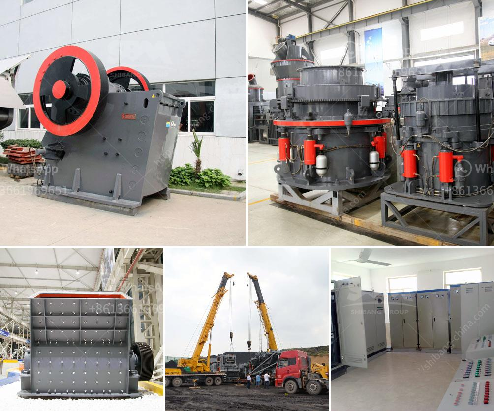

<h3>what is the feed size for ball mill？</h3>
The feed size for a ball mill is the particle size of the material to be grinded, which is important in determining the performance of the ball mill. Therefore, it is crucial to properly understand the feed size requirements of the ball mill.

The feed size for a ball mill can range from several millimeters to several micrometers, depending on the characteristics of the material being grinded and the desired final fineness. In general, the feed size for a ball mill is usually between 20mm and 25mm for hard materials and between 15mm and 20mm for softer materials.

The feed size of the material being grinded is a critical factor that affects the capacity, energy consumption, and grinding efficiency of the ball mill. If the feed size is too large, the grinding media will not effectively grind the particles, leading to a decrease in grinding efficiency and an increase in energy consumption. On the other hand, if the feed size is too small, the grinding media may become overloaded, leading to reduced capacity and inefficient grinding.

Determining the appropriate feed size for a ball mill involves considering the characteristics of the material being grinded and the desired final fineness. For example, if the material is brittle and has a low hardness, a smaller feed size may be preferred to avoid excessive wear of the grinding media. On the other hand, if the material is hard and abrasive, a larger feed size may be required to achieve the desired fineness efficiently.

It is also worth mentioning that the feed size distribution can have a significant impact on the performance of the ball mill. Ideally, the feed size distribution should be narrow and uniform to ensure efficient grinding. If the feed size distribution is too wide, with a significant amount of coarse particles, the mill may become overloaded, leading to reduced capacity and inefficient grinding.

Furthermore, the feed size for a ball mill can also be influenced by the design and operating conditions of the mill. Factors such as the mill speed, the ball size, and the slurry rheology can affect the grinding performance and consequently the optimal feed size.

In conclusion, the feed size for a ball mill is the particle size of the material to be grinded. Understanding the feed size requirements of the ball mill is crucial for optimizing the grinding performance. A proper feed size can ensure efficient grinding, improved capacity, and reduced energy consumption. Therefore, it is essential to consider the characteristics of the material being grinded and the desired final fineness when determining the appropriate feed size for a ball mill.
<h3>Contact us</h3><ul><li><strong>Whatsapp:&nbsp;<a href="https://wa.me/8613661969651">+8613661969651</a></strong></li><li><a href="https://swt.shibang-china.com/?git&amp;zhl&amp;what is the feed size for ball mill？"><strong>Online Service(chat now)</strong></a></li></ul><h3>Related</h3><ul><li><a href='What is grindind machine.md'>What is grindind machine?</a></li><li><a href='What is the process of mining iron ore.md'>What is the process of mining iron ore?</a></li><li><a href='What equipment is used to mine gold in Australia？.md'>What equipment is used to mine gold in Australia？</a></li><li><a href='what is the difference between river sand and crusher sand.md'>what is the difference between river sand and crusher sand</a></li><li><a href='What is the cost of a quarry crusher for 500 tons.md'>What is the cost of a quarry crusher for 500 tons?</a></li></ul>