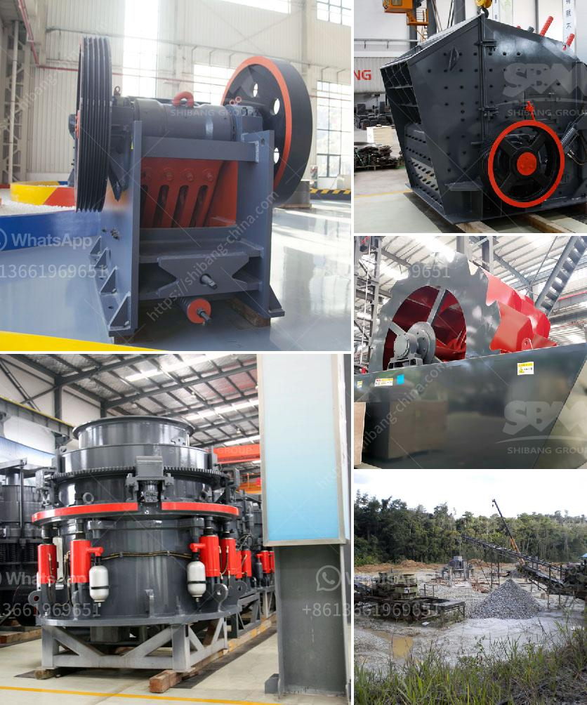

<h3>what is the primary use for dolomite rock</h3>
Dolomite rock is a sedimentary carbonate rock that is composed mainly of calcium magnesium carbonate. It is formed as a result of the chemical alteration of limestone or calcite through dolomitization, a process in which calcium carbonate minerals are gradually replaced by magnesium carbonate.

The primary use for dolomite rock is in the construction industry. Due to its hardness and durability, dolomite rock has been used as a building and decorative material for centuries. It is commonly crushed and used as a base material for road construction, as well as for the production of concrete and asphalt. Dolomite rock's high strength and resistance to weathering make it an ideal material for road surfaces and driveways that are subject to heavy traffic and harsh environmental conditions.

Dolomite rock is also extensively used in the production of cement. When it is heated at high temperatures, dolomite decomposes to release carbon dioxide and calcium oxide, both of which are essential components of cement production. The calcium oxide, or lime, derived from dolomite rock is mixed with other materials such as silica, alumina, and iron oxide to form clinker, which is then finely ground to produce cement. Dolomite cement offers various advantages, including high early strength and resistance to sulfate attack, making it a preferred choice in the construction industry.

Another significant use for dolomite rock is as a source of magnesium. Magnesium is an essential element that plays a vital role in various biological processes, such as muscle and nerve function, as well as the formation of healthy bones and teeth. Dolomite rock contains a high percentage of magnesium, and after extraction and purification, it can be processed into magnesium compounds that are used in various industries. Magnesium derivatives obtained from dolomite rock are used in the production of fertilizers, animal feed supplements, and a wide range of industrial applications, including the manufacturing of chemicals, ceramics, glass, and metals.

Additionally, dolomite rock is valued for its ornamental features and is widely used in landscaping and as a decorative stone in gardens, parks, and buildings. Its unique blend of colors, ranging from white and gray to pink and green, can add aesthetic value to any outdoor or indoor space.

In conclusion, dolomite rock serves multiple purposes across different industries. Its primary use lies in the construction sector, where it is widely utilized as a building and road construction material, as well as in cement production. Furthermore, dolomite rock's high magnesium content makes it a valuable resource for extracting magnesium compounds used in various industrial applications. Finally, its aesthetic qualities make it a sought-after ornamental stone for landscaping and design purposes.
<h3>Contact us</h3><ul><li><strong>Whatsapp:&nbsp;<a href="https://wa.me/8613661969651">+8613661969651</a></strong></li><li><a href="https://swt.shibang-china.com/?git&amp;zhl&amp;what is the primary use for dolomite rock"><strong>Online Service(chat now)</strong></a></li></ul><h3>Related</h3><ul><li><a href='What is aluminium ore benefication process.md'>What is aluminium ore benefication process?</a></li><li><a href='What is the cost of limestone crushing process .md'>What is the cost of limestone crushing process ?</a></li><li><a href='What are the characteristics of bauxite ore and how to crush it.md'>What are the characteristics of bauxite ore and how to crush it?</a></li><li><a href='what are some of the equipments used in mining industry.md'>what are some of the equipments used in mining industry?</a></li><li><a href='What is wet process cement.md'>What is wet process cement?</a></li></ul>