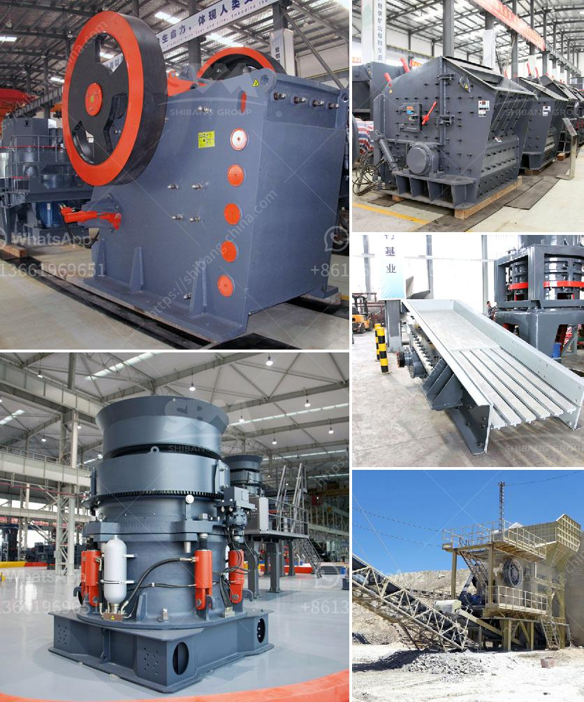

<h3>what is the running cost for a jaw crusher?</h3>
A jaw crusher is a popular crushing equipment in the engineering sector. While the initial investment in a jaw crusher can be quite high, running costs are relatively low due to its simple design and robust structure. This makes jaw crushers a cost-effective alternative for large-scale crushing operations.

One of the primary factors influencing the running cost of a jaw crusher is the crushing capacity. Larger crushers consume more energy to operate, which increases overall operational costs. Therefore, it is important to consider the required crushing capacity when selecting a jaw crusher model.

Another factor to consider is the feed size. Jaw crushers are designed to crush larger rocks into smaller ones, making them suitable for various applications. However, crushing larger rocks can put more strain on the equipment, resulting in increased power consumption and reduced efficiency. Therefore, optimizing the feed size can help lower the running cost of a jaw crusher.

Maintenance and service costs are also important considerations when calculating the running cost for a jaw crusher. Regular maintenance and timely servicing ensure that the equipment operates at its optimal performance and minimizes the risk of breakdowns or failures. Neglecting maintenance can lead to unexpected downtime and costly repairs.

Wear parts, such as the jaw plates and liners, need to be periodically replaced to maintain the crusher's efficiency. The frequency of replacements depends on various factors, including the material being crushed, the operating conditions, and the crushing capacity. Using high-quality wear parts can extend the lifespan of the crusher and reduce the overall running cost.

Additionally, the type of crusher lubrication system can impact the running cost. Grease-based lubrication systems are commonly used for jaw crushers due to their simplicity and cost-effectiveness. However, these systems require regular greasing, which adds to the maintenance cost. On the other hand, automatic oil lubrication systems, while more expensive initially, have a longer service interval, reducing the overall maintenance cost.

Energy consumption is another significant aspect of the running cost for a jaw crusher. Most jaw crushers operate on electric power, which can be costly, especially if the crusher is running continuously or for extended periods. Efficient energy management, such as optimizing the crusher's operating speed or using intelligent control systems, can help reduce energy consumption and lower running costs.

In conclusion, the running cost for a jaw crusher depends on several factors, including its crushing capacity, feed size, maintenance and service costs, wear parts replacements, lubrication system, and energy consumption. Understanding these factors and carefully considering them during equipment selection and operation can result in significant cost savings in the long term. Therefore, it is crucial for operators to conduct a thorough analysis of the running cost before investing in a jaw crusher.
<h3>Contact us</h3><ul><li><strong>Whatsapp:&nbsp;<a href="https://wa.me/8613661969651">+8613661969651</a></strong></li><li><a href="https://swt.shibang-china.com/?git&amp;zhl&amp;what is the running cost for a jaw crusher"><strong>Online Service(chat now)</strong></a></li></ul><h3>Related</h3><ul><li><a href='What machine need to be used for rock mining industry.md'>What machine need to be used for rock mining industry?</a></li><li><a href='What is the most popular rock crusher on market.md'>What is the most popular rock crusher on market?</a></li><li><a href='Which industries depend on coal.md'>Which industries depend on coal?</a></li><li><a href='What is barite and how is it mined.md'>What is barite and how is it mined?</a></li><li><a href='What equipment and machinery are needed to mine marble.md'>What equipment and machinery are needed to mine marble?</a></li></ul>