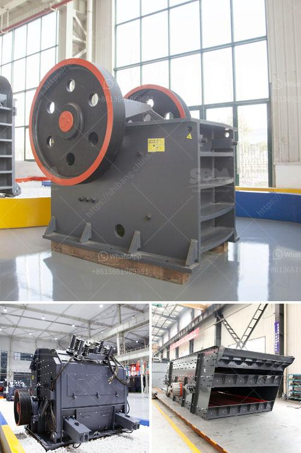

<h3>what is throughput for a cement grinding ball mill？</h3>
Cement grinding ball mills are perhaps the most common types of grinding mills used in cement plants worldwide. Throughput for a typical ball mill is around 150 tons per hour, meaning that the actual grinding capacity of the mill depends on the specific material being ground, and the fineness required.

To achieve the required throughput, a variety of grinding balls are available and their usage depends on the specific material being ground. Traditionally, cast iron or steel balls are used as grinding media in ball mills. However, modern grinding balls are made from high-quality materials such as ceramic, steel, and chrome alloy. These balls are more durable, resist wear and tear, and deliver better performance compared to traditional steel balls.

Throughput for a cement grinding ball mill is typically in the range of 50-100% capacity. Increasing the throughput beyond this range is challenging and requires careful optimization of the mill's design and operating parameters. Higher throughput can be achieved by increasing the diameter of the mill but this requires significant investment and may also impact the overall profitability of the cement plant.

Factors that influence the throughput of a cement grinding ball mill include liner design, mill speed, mill diameter, media size and shape, grinding efficiency, and the size distribution of the feed material. These factors need to be considered during the design and operation of the mill to ensure optimal performance and higher throughput.

Liner design plays a crucial role in determining the grinding efficiency and throughput of a ball mill. Different liner designs can impact the trajectory, energy transfer, and grinding media movement inside the mill. The choice of liner materials, such as rubber, steel, or composite, can also affect the throughput. A well-designed liner system can increase the grinding efficiency and reduce energy consumption.

Mill speed is another important factor that affects the throughput of a ball mill. The optimal mill speed depends on the material being ground and its properties, as well as the desired fineness. Increasing the mill speed can enhance the impact and grinding force between the grinding media and the feed material, leading to higher throughput. However, exceeding the critical speed can cause the grinding media to be flung against the mill walls, resulting in excessive wear and reduced throughput.

The size and shape of the grinding media also play a critical role in the grinding process and throughput. Larger grinding media can generate higher impact forces and break the larger particles more effectively, leading to higher throughput. On the other hand, smaller media can provide better grinding efficiency and achieve finer particle sizes. The choice of media size should be carefully considered based on the specific grinding requirements.

In conclusion, throughput for a cement grinding ball mill depends on various factors such as liner design, mill speed, media size and shape, grinding efficiency, and the size distribution of the feed material. Optimizing these factors is essential to achieve higher throughput without compromising the quality and fineness of the final product. Cement plant operators should work closely with mill manufacturers and process optimization experts to identify the best operating parameters and maximize throughput, ultimately improving the overall efficiency and profitability of the grinding process.
<h3>Contact us</h3><ul><li><strong>Whatsapp:&nbsp;<a href="https://wa.me/8613661969651">+8613661969651</a></strong></li><li><a href="https://swt.shibang-china.com/?git&amp;zhl&amp;what is throughput for a cement grinding ball mill？"><strong>Online Service(chat now)</strong></a></li></ul><h3>Related</h3><ul><li><a href='What is a grinding ball mill aid.md'>What is a grinding ball mill aid?</a></li><li><a href='What is hematite magnetic limonite and rhodochrosite.md'>What is hematite, magnetic limonite and rhodochrosite?</a></li><li><a href='What is the process of sandstone mining？.md'>What is the process of sandstone mining？</a></li><li><a href='What is approximate cost of a jaw crusher.md'>What is approximate cost of a jaw crusher?</a></li><li><a href='What are the machines and equipment in mining.md'>What are the machines and equipment in mining?</a></li></ul>