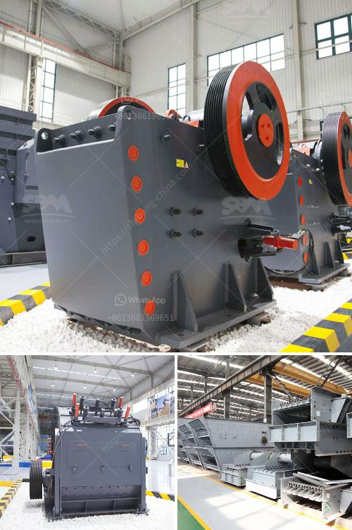

<h3>what is universal grinding machine？</h3>
Universal grinding machine is a versatile machine tool that can perform various types of grinding operations. It is an efficient and flexible machine tool designed for manufacturing and sharpening cutting tools, grinding cylindrical and profiled surfaces, and external and internal grinding. The universal grinding machine belongs to the general-purpose tool grinding machine family, which can operate with a wide range of cutting tools, including flat, ball-nosed, and cylindrical tools.

One of the primary advantages of a universal grinding machine is its flexibility. This machine can perform various grinding operations, such as cylindrical grinding, internal grinding, and surface grinding. The grinding wheel can be used to grind cylindrical surfaces, shoulders, and bores, making it a valuable tool for both large-scale manufacturing and small-scale workshops.

Universal grinding machines are commonly used in precision machining due to their accuracy and versatility. These machines are suitable for grinding complex shapes and profiles on a variety of workpieces, including turbine blades, gearboxes, and hydraulic components. By using different attachments and accessories, the universal grinding machine can be customized to perform specialized grinding operations, such as thread grinding, gear grinding, and camshaft grinding.

Another key feature of the universal grinding machine is its ability to generate precision by using high-quality grinding wheels. The grinding wheel is the heart of the machine and determines the quality and efficiency of the grinding process. Different materials, bond types, and abrasive grains can be used to optimize the performance of the grinding wheel, ensuring the desired surface finish, dimensional accuracy, and tool life.

The universal grinding machine can be operated manually or with automatic controls. Manual operation gives the operator full control over the grinding process, allowing them to adjust parameters like feed rates, depth of cut, and grinding speed. On the other hand, automatic controls can be used for high-volume production, providing consistent and repeatable results. With modern CNC (Computer Numerical Control) technologies, the universal grinding machine can be programmed to automatically change grinding wheels, control spindle speed, and measure workpiece dimensions, further enhancing productivity and accuracy.

In conclusion, the universal grinding machine is a versatile and efficient machine tool that can perform various types of grinding operations. Its flexibility allows for the grinding of a wide range of cutting tools and workpieces, making it an essential tool for industries such as automotive, aerospace, and tool manufacturing. With advancements in technology, the universal grinding machine continues to evolve, offering increased precision, productivity, and control.
<h3>Contact us</h3><ul><li><strong>Whatsapp:&nbsp;<a href="https://wa.me/8613661969651">+8613661969651</a></strong></li><li><a href="https://swt.shibang-china.com/?git&amp;zhl&amp;what is universal grinding machine？"><strong>Online Service(chat now)</strong></a></li></ul><h3>Related</h3><ul><li><a href='What can be used for basalt.md'>What can be used for basalt?</a></li><li><a href='What equipment is needed for silicon ore mines.md'>What equipment is needed for silicon ore mines?</a></li><li><a href='What is the cost of limestone crushing process .md'>What is the cost of limestone crushing process ?</a></li><li><a href='what crusher types are used in copper processing in zambia.md'>what crusher types are used in copper processing in zambia?</a></li><li><a href='What is the optimum frequency for a vibrating screen.md'>What is the optimum frequency for a vibrating screen?</a></li></ul>