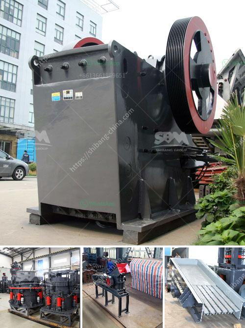

<h3>what jaw crushers speed rpm should do</h3>
Jaw crushers are widely used in mining, metallurgical, construction, chemical, petrochemical, and various other industries. They come in different sizes and capacities to accommodate different types of applications. One important factor to consider when purchasing a jaw crusher is the speed at which it operates. The speed of a jaw crusher is usually measured in revolutions per minute (RPM).

The speed may affect the performance of the crusher in several ways - being either too slow or too fast can cause a range of problems. Slower speeds can lead to a decrease in productivity and throughput, as the material may not be effectively crushed and processed. On the other hand, higher speeds can lead to increased wear on the crusher components and can even cause damage to the machine.

Determining the optimal speed for a jaw crusher depends on various factors such as the type of material being crushed, the size distribution of the feed material, the hardness of the material, the desired final product size, and the capacity requirements.

In general, for most applications, a jaw crusher's optimal speed range is between 200 and 400 RPM. This speed is referred to as the critical speed. It refers to the speed at which the crusher produces the maximum amount of material in a single pass. The critical speed varies depending on the jaw crusher model and the nature of the material being crushed.

When the jaw crusher operates at its optimal speed, the material is efficiently crushed and discharged at the desired size. However, operating below or above the optimal speed can lead to various issues.

Operating the crusher at a slower speed than the optimal RPM can result in a decrease in productivity. The crusher may struggle to break down and process the material efficiently, leading to longer processing times and reduced throughput. Additionally, a slow speed can cause the material to accumulate in the crushing chamber, increasing the risk of blockages and downtime.

Conversely, operating the crusher at a higher speed than the optimal RPM can increase the wear on the crusher components. The increased speed can generate excessive forces, leading to premature wear and damage to the jaw plates, bearings, and other parts of the crusher. This can result in higher maintenance costs and more frequent replacements of worn-out parts.

In conclusion, choosing the right speed for a jaw crusher is essential to optimize its performance. Operating within the recommended RPM range allows for efficient crushing and ensures the production of the desired final product size. It's important to consider factors such as the type and hardness of the material, the desired capacity, and the crusher model when determining the optimal speed. Properly maintaining and lubricating the crusher can also help prolong its lifespan and ensure its smooth operation.
<h3>Contact us</h3><ul><li><strong>Whatsapp:&nbsp;<a href="https://wa.me/8613661969651">+8613661969651</a></strong></li><li><a href="https://swt.shibang-china.com/?git&amp;zhl&amp;what jaw crushers speed rpm should do"><strong>Online Service(chat now)</strong></a></li></ul><h3>Related</h3><ul><li><a href='What is the difference between a roll crusher and a hammer mill.md'>What is the difference between a roll crusher and a hammer mill?</a></li><li><a href='What equipment is needed for silicon ore mines.md'>What equipment is needed for silicon ore mines?</a></li><li><a href='What is the cost of the equipment used in mining lead ore.md'>What is the cost of the equipment used in mining lead ore?</a></li><li><a href='What are factors that will affect the output of a cement mill.md'>What are factors that will affect the output of a cement mill?</a></li><li><a href='What does the crushing of copper ore have to do with ball mills.md'>What does the crushing of copper ore have to do with ball mills?</a></li></ul>