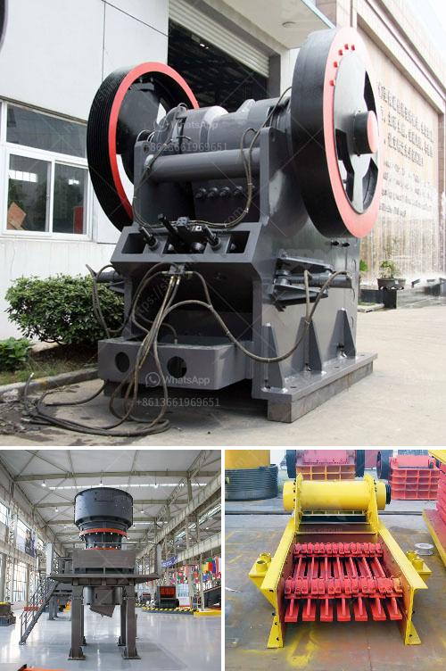

<h3>what kind of crushing machinery is used for crushing rock？</h3>
The process of crushing rocks is vital in many industrial sectors, including construction, mining, and manufacturing. By breaking down the rock into smaller pieces, it becomes easier to handle and transport, allowing for efficient operations. In order to carry out this task, specific types of crushing machinery are used. Let's take a closer look at the different kinds of crushing machinery that are commonly employed for rock crushing.

One of the most widely used machines for rock crushing is the jaw crusher. This primary crusher is known for its exceptional reliability and durability. It consists of two jaws that are positioned in a V-shaped configuration, with one jaw being stationary and the other moving back and forth. As the rock enters the crushing chamber, it is crushed between the two jaws until it reaches the desired size. With its strong crushing force, the jaw crusher is capable of handling even the toughest rocks.

Another commonly used crushing machine is the impact crusher. As the name suggests, this machine uses impact to break down the rock. It employs a high-speed rotor with a series of hammers that strike the material as it enters the crushing chamber. The impact crusher is well-suited for crushing a variety of rocks, including limestone, sandstone, and granite. It offers high production capacity and excellent reduction ratios, making it a popular choice for many applications.

For more precise crushing, cone crushers are often used. These machines have a cone-shaped crushing head that rotates at high speeds, providing a gyratory motion to the rock. As the rock enters the top of the crusher, it is squeezed between the crushing surfaces. The cone crushers are known for their efficiency and versatility, making them suitable for a wide range of crushing applications.

In addition to these primary crushing machines, there are also secondary and tertiary crushers that are employed for further processing. Secondary crushers, like the cone crusher, further reduce the size of the rocks, while tertiary crushers, such as vertical shaft impactors, produce even finer materials. These machines are commonly used in the mining industry to produce high-quality aggregates for construction purposes.

It is worth mentioning that different types of crushing machinery may be more suitable for specific types of rocks. For example, softer rocks like limestone may be easily crushed by jaw crushers or cone crushers, while harder rocks like granite may require the use of more robust machines like impact crushers.

In conclusion, crushing machinery plays a crucial role in various industries, enabling the reduction of rocks into smaller, manageable sizes. From jaw crushers and impact crushers to cone crushers and vertical shaft impactors, there are several types of crushing machinery used for rock crushing. Each machine offers unique features and advantages, catering to different crushing needs. By selecting the appropriate machinery, industries can optimize their operations and achieve desired outcomes efficiently.
<h3>Contact us</h3><ul><li><strong>Whatsapp:&nbsp;<a href="https://wa.me/8613661969651">+8613661969651</a></strong></li><li><a href="https://swt.shibang-china.com/?git&amp;zhl&amp;what kind of crushing machinery is used for crushing rock？"><strong>Online Service(chat now)</strong></a></li></ul><h3>Related</h3><ul><li><a href='what are some of the equipments used in mining industry.md'>what are some of the equipments used in mining industry?</a></li><li><a href='What is the most popular rock crusher on market.md'>What is the most popular rock crusher on market?</a></li><li><a href='What is the process of mining and extraction of gold and molybdenum.md'>What is the process of mining and extraction of gold and molybdenum?</a></li><li><a href='What does the concrete batching plant contain.md'>What does the concrete batching plant contain?</a></li><li><a href='what is alluvial gold mining.md'>what is alluvial gold mining?</a></li></ul>