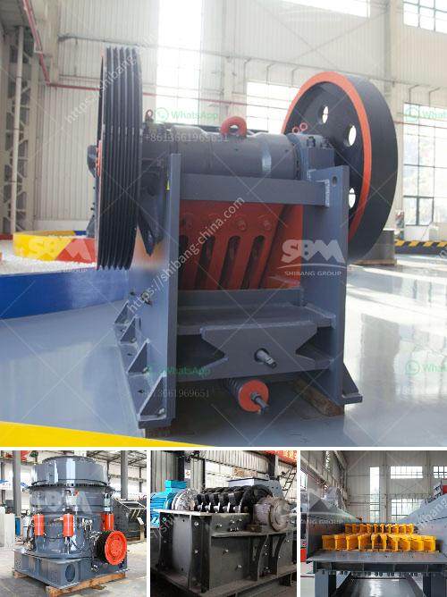

<h3>what some of the equipment used in handling materials in the mining industry？</h3>
In the mining industry, the handling of materials is an essential process that ensures efficient and safe extraction of valuable minerals from the earth. Various pieces of equipment are specifically designed to handle these materials, enabling mining operations to run smoothly and effectively. This article will explore some of the equipment used in handling materials in the mining industry.

One of the most common types of equipment used in material handling within mining operations is the conveyor belt system. Conveyor belts are used to transport bulk materials over long distances, enabling efficient movement of materials from one location to another. These belts are made of durable materials and are capable of handling heavy loads. They are also customizable to fit specific mining requirements.

In conjunction with conveyor belts, bucket elevators are also commonly used in mining material handling. These machines consist of a series of buckets that are attached to a chain or belt and are used to transport bulk materials vertically. Bucket elevators are ideal for hauling materials such as coal, ore, and minerals from one level to another within a mining facility.

Another essential equipment in material handling within the mining industry is the stacker/reclaimer system. This system includes a stacker, which places bulk materials in a controlled manner onto a stockpile, and a reclaimer, which recovers the materials from the stockpile for further processing or transportation. Stacker/reclaimer systems are particularly useful in stockpiling large quantities of materials and maintaining an organized mining site.

Cranes are also commonly used in material handling in mining operations. These heavy-duty machines are used to lift and move large and heavy loads, such as machinery, equipment, and bulk materials. Cranes come in various forms, including tower cranes, mobile cranes, and overhead cranes, each designed for different mining requirements. They offer flexibility and maneuverability, allowing for efficient material handling even in challenging terrains.

Front-end loaders, also known as wheel loaders, are another crucial piece of equipment used in handling materials in the mining industry. These machines are equipped with a large bucket attached to the front that can be used to scoop and transport materials, such as rocks, ore, and coal. Front-end loaders are versatile and can perform various tasks, including loading trucks, stockpiling materials, and leveling surfaces, making them indispensable in mining operations.

In conclusion, the efficient handling of materials is essential in the mining industry, and various equipment are used to ensure smooth operations. Conveyor belts, bucket elevators, stacker/reclaimer systems, cranes, and front-end loaders are just a few examples of the equipment used in material handling in mining operations. These machines allow for the safe and efficient movement of bulk materials, facilitating the extraction of valuable minerals from the earth. As technology continues to advance, new equipment and innovations in material handling will undoubtedly further improve the efficiency and safety of mining operations.
<h3>Contact us</h3><ul><li><strong>Whatsapp:&nbsp;<a href="https://wa.me/8613661969651">+8613661969651</a></strong></li><li><a href="https://swt.shibang-china.com/?git&amp;zhl&amp;what some of the equipment used in handling materials in the mining industry？"><strong>Online Service(chat now)</strong></a></li></ul><h3>Related</h3><ul><li><a href='What machinery is used in copper mining .md'>What machinery is used in copper mining ?</a></li><li><a href='What are the ore and vein minerals in coal mines .md'>What are the ore and vein minerals in coal mines ?</a></li><li><a href='What equipment is used in the mining industry .md'>What equipment is used in the mining industry ?</a></li><li><a href='What type of mining is used for magnetite.md'>What type of mining is used for magnetite?</a></li><li><a href='What is roller crusher.md'>What is roller crusher?</a></li></ul>