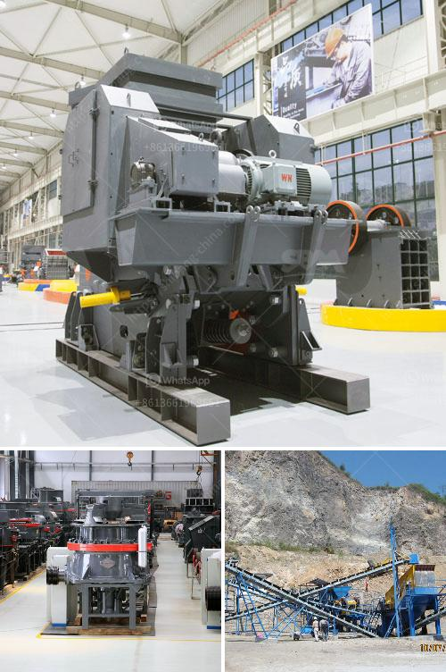

<h3>what type of crusher is best for concrete crushing?</h3>
When it comes to concrete recycling, the need for a concrete crusher capable of handling difficult conditions is undeniable. While some traditional crushers are suitable for concrete recycling, mobile crushers are designed specifically for this task. With advancements in technology, concrete crushers have opened up possibilities for crushing concrete in all types of construction projects.

Crushing concrete at the site or in a controlled environment is undeniably an excellent option. It makes it easy to store and transport the recycled concrete, which can then be reused in various construction projects. Most crushers can process raw concrete into aggregate of different sizes, as well as control the desired output without further refining. 

However, not all crushers are effective for concrete recycling. Some crushing plants are old-fashioned and produce inadequate aggregate shapes or sizes. This often leads to problems such as excessive dust emissions. Additionally, some crushers can have high wear and tear on machinery, which can result in frequent breakdowns and increased maintenance costs.

For these reasons, it is crucial to use the right type of crusher that can efficiently process concrete materials. Mobile crushers, known as track-mounted crushers, are an excellent option for recycling concrete because they are able to provide the necessary productivity and portability. These crushers excel in processing the most abrasive materials, such as granite or recycled concrete, with ease.

One of the key benefits of using a mobile crusher is the flexibility and convenience it brings. This type of crusher can be moved from site to site as the project progresses. Mobile crushers can be installed in different locations, ensuring flexibility in mixing and matching equipment for maximum efficiency. Additionally, some models can be easily transported on trailers, allowing them to be quickly set up and started on-site.

When it comes to concrete recycling, impact crushers are considered the best option. Their large feed opening and chamber design allow them to produce quality aggregate with high reduction ratios. Impact crushers also offer high crushing forces and can process even the hardest materials, making them suitable for crushing concrete.

Another important feature of a crusher suitable for concrete recycling is the ability to handle steel reinforcement. Steel is a common reinforcement material used in concrete construction. It is essential to remove steel before crushing the concrete. Using electromagnetic separators, a mobile crusher can separate any unwanted metals from the crushed material.

In conclusion, a mobile concrete crusher can be used as a primary crusher during concrete recycling. With the help of advancements in technology, concrete crushers have become more effective at processing concrete. Additionally, mobile crushers allow for better versatility and portability for recycling concrete in various construction projects. When choosing a crusher, factors such as the type and size of the concrete, its reinforcement, and the desired output should be considered to select the most suitable equipment.
<h3>Contact us</h3><ul><li><strong>Whatsapp:&nbsp;<a href="https://wa.me/8613661969651">+8613661969651</a></strong></li><li><a href="https://swt.shibang-china.com/?git&amp;zhl&amp;what type of crusher is best for concrete crushing"><strong>Online Service(chat now)</strong></a></li></ul><h3>Related</h3><ul><li><a href='What are the most common expenses in crushing plant project.md'>What are the most common expenses in crushing plant project?</a></li><li><a href='What is the process of mining iron ore.md'>What is the process of mining iron ore?</a></li><li><a href='What does the crushing of copper ore have to do with ball mills.md'>What does the crushing of copper ore have to do with ball mills?</a></li><li><a href='What is the difference between stationary and mobile crushers.md'>What is the difference between stationary and mobile crushers?</a></li><li><a href='What are the raw materials used in cement production.md'>What are the raw materials used in cement production?</a></li></ul>