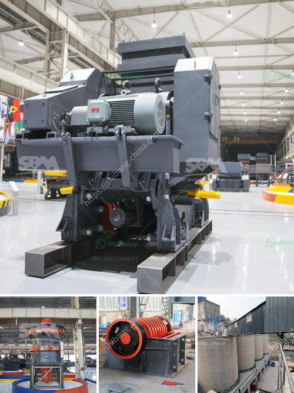

<h3>what type of pumps uesd in stone crusher？</h3>
When it comes to building and constructing materials, one of the most common and important pieces of equipment is a crusher. As the name suggests, a crusher is used to crush rocks and stones to smaller sizes for various construction purposes. However, crushers require efficient and reliable pumps to operate smoothly and effectively. In this article, we will explore the different types of pumps used in stone crushers.

The primary function of a crusher pump is to provide hydraulic support for the machine's components, preventing them from being damaged due to excessive pressure. The pump also ensures lubrication of the crusher bearings, which in turn prevents premature wear and tear. Consequently, the type of pump chosen for a stone crusher plays a crucial role in ensuring trouble-free operation and minimal maintenance.

One commonly used pump in the stone crusher industry is the centrifugal pump. This pump works on the principle of the transfer of kinetic energy by a rotating impeller to the fluid being pumped. Centrifugal pumps are usually reliable, have a high flow rate capacity, and are available in various sizes to meet the specific needs of different stone crushers.

Another type of pump commonly used in stone crushers is the positive displacement pump. Unlike centrifugal pumps, positive displacement pumps operate by trapping a certain amount of fluid and forcing it into the discharge pipe. This creates a steady flow, which is ideal for precise control, especially in applications where specific pressure levels are required. Positive displacement pumps are known for their consistency, reliability, and ability to handle viscous and abrasive fluids.

Additionally, stone crushers may employ gear pumps to ensure smooth and precise operation. Gear pumps function by using a pair of gears to trap and transfer fluid. These pumps are known for their simplicity, durability, and ability to handle both high and low viscosity fluids. Gear pumps are often used in stone crushers due to their efficiency and ability to maintain constant pressure and flow.

The choice of pump used in a stone crusher depends on various factors, including the type and size of the crusher, the operating conditions, and the specific requirements of the stone crushing process. It is crucial to select a pump that is reliable, durable, has a high flow rate capability, and can handle the abrasive nature of stones and rocks.

In conclusion, stone crushers rely on efficient and reliable pumps to operate seamlessly. The choice of pump depends on factors like the size and type of the crusher, operational requirements, and the characteristics of the stones being crushed. Centrifugal pumps, positive displacement pumps, and gear pumps are among the most commonly used in the stone crusher industry. Choosing the right pump is crucial to ensure smooth and trouble-free operation while minimizing maintenance and downtime.
<h3>Contact us</h3><ul><li><strong>Whatsapp:&nbsp;<a href="https://wa.me/8613661969651">+8613661969651</a></strong></li><li><a href="https://swt.shibang-china.com/?git&amp;zhl&amp;what type of pumps uesd in stone crusher？"><strong>Online Service(chat now)</strong></a></li></ul><h3>Related</h3><ul><li><a href='What is the difference between an open circuit and a closed circuit ball mill.md'>What is the difference between an open circuit and a closed circuit ball mill?</a></li><li><a href='What machinery is used in copper mining .md'>What machinery is used in copper mining ?</a></li><li><a href='what are the applications of small portable crusher.md'>what are the applications of small portable crusher?</a></li><li><a href='What equipment is needed for boron ore mines.md'>What equipment is needed for boron ore mines?</a></li><li><a href='What is the separation process in a vertical raw mill.md'>What is the separation process in a vertical raw mill?</a></li></ul>