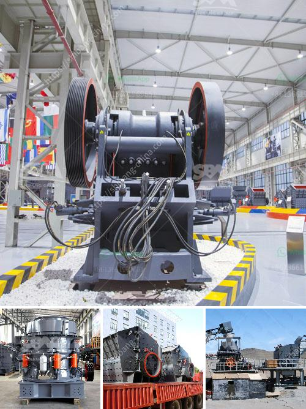

<h3>what types of jaw crushers</h3>
Jaw crushers are used in various industrial applications such as mining, building materials, and recycling. Depending on the type of material to be crushed and the desired output, there are different types of jaw crushers available in the market. These crushers are designed to handle different capacities, ranging from small scale to large scale operations. In this article, we will explore the different types of jaw crushers and their features.

This type of jaw crusher is characterized by its prominent and non-reversible swing jaw movement. It is widely used in the primary crushing stage for various industries such as mining, building materials, and construction. The Blake jaw crusher utilizes a double toggle mechanism for efficient crushing action and higher production capacity.

Similar to the Blake jaw crusher, the Dodge jaw crusher utilizes a variable discharge area and a fixed swing jaw. It is commonly used in the secondary and tertiary crushing stages. The Dodge jaw crusher has a variable feed area and a fixed discharge area which leads to choking of the crusher and hence, is used only for laboratory purposes and not for heavy duty operations.

The universal jaw crusher is a type of jaw crusher which features fixed and moving jaw plates. These plates are inclined at an angle with the fixed jaw plate and move in a parallel motion towards the discharge end. The universal jaw crusher can handle a wide range of materials, including hard rock, ores, and minerals.

This type of jaw crusher is characterized by its eccentric shaft, bearings, and double toggle mechanism. The double toggle jaw crusher is commonly used in the mining and quarrying industry for its ability to crush hard materials and generate a consistent product size. It also has a large feed opening and a hydraulic toggle system to ensure efficient and safe operation.

The overhead eccentric jaw crusher is similar to the double toggle jaw crusher, but with a few key differences. Instead of a swinging jaw, the overhead eccentric jaw crusher features an eccentrically mounted shaft that rotates and moves the jaw in a circular motion. This type of jaw crusher is preferred for its compact design, ease of maintenance, and low operating costs.

In conclusion, jaw crushers are essential in the mining, construction, and recycling industries. Understanding the different types of jaw crushers available will help you choose the most suitable machine for your application. Whether it is a Blake, Dodge, universal, double toggle, or overhead eccentric jaw crusher, each type has its advantages and caters to specific needs. It is recommended to consult with experts or manufacturers to determine the best jaw crusher for your requirements and ensure optimal performance and productivity.
<h3>Contact us</h3><ul><li><strong>Whatsapp:&nbsp;<a href="https://wa.me/8613661969651">+8613661969651</a></strong></li><li><a href="https://swt.shibang-china.com/?git&amp;zhl&amp;what types of jaw crushers"><strong>Online Service(chat now)</strong></a></li></ul><h3>Related</h3><ul><li><a href='What is the difference between stationary and mobile crushers.md'>What is the difference between stationary and mobile crushers?</a></li><li><a href='What is a rare earth beneficiation plant.md'>What is a rare earth beneficiation plant?</a></li><li><a href='what type of crusher is best for concrete crushing.md'>what type of crusher is best for concrete crushing?</a></li><li><a href='What is the machine used in hard rock gold mining.md'>What is the machine used in hard rock gold mining?</a></li><li><a href='What equipment is needed for phosphorite ore mines.md'>What equipment is needed for phosphorite ore mines?</a></li></ul>