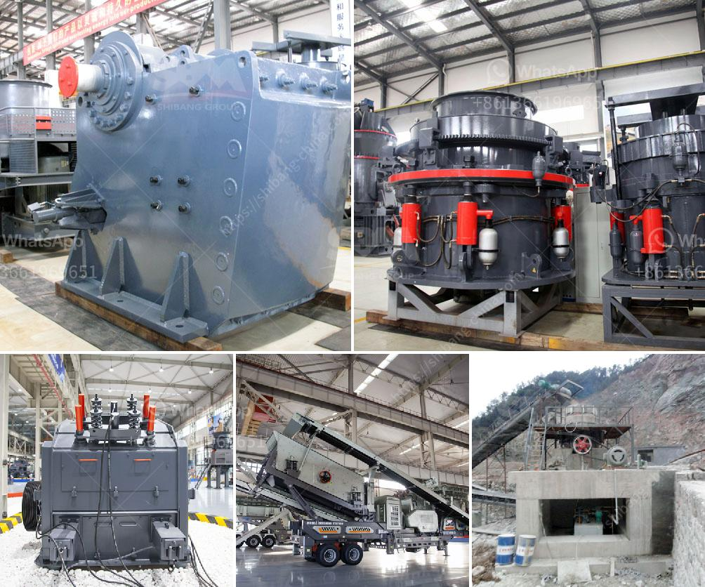

<h3>when pulverizing coal what is a crusher use for？</h3>
When it comes to coal, many people might think of it as a simple solid fuel used in industries to generate electricity. However, before coal can be used in power plants or other industries, it needs to undergo a process of pulverization. To achieve this, a crusher is used.

A crusher is a machine that breaks down large pieces of coal into smaller ones, making them suitable for further processing. Crushing reduces the overall size of these pieces to a maximum of around 1 inch, ensuring they are evenly sized for efficient combustion in a boiler.

1. Coal preparation: The mined coal is first stored in stockpiles, where it is blended to achieve a consistent composition. This crucial step ensures that the coal has the required properties for efficient combustion. It also helps in removing impurities and foreign materials from the coal.

2. Crushing: Once the coal is adequately prepared, it is fed into a crusher to break down the large chunks into smaller pieces. Crushers typically have rotating shafts that grind the larger coal pieces against a stationary plate. The crushing action reduces the coal to a more homogeneous size, making it easier to handle and transport.

3. Screening: After the coal is crushed, it is passed through a series of screens to sort it based on size. The screens help separate the coal into different fractions, ensuring a consistent size range for efficient combustion. The smaller-sized coal is usually sent to power plants, while the larger-sized coal may require further processing.

4. Storage and transportation: Once the coal is pulverized, it is stored in silos or bins before being transported to its final destination. During storage, additives can be mixed with the coal to enhance its combustion properties or reduce emissions. The pulverized coal is usually transported via conveyors or trucks to power plants or other industries that require it as a fuel source.

It is important to understand that coal pulverization is essential for several reasons. Firstly, pulverization increases the surface area of coal, making it easier to ignite and burn. This, in turn, improves the efficiency of combustion, leading to increased energy production from the same amount of coal. Additionally, pulverization ensures that the coal burns evenly, reducing emissions and improving air quality.

There are various types of crushers used in the coal pulverization process. Jaw crushers, gyratory crushers, cone crushers, and impact crushers are some of the commonly used crushers in this process. Each type has its own unique features and advantages, allowing operators to select the most suitable crusher based on their specific requirements.

To summarize, the importance of a crusher in pulverizing coal cannot be overlooked. It plays a crucial role in reducing the coal size, improving combustion efficiency, and enhancing overall operational performance. Without crushers, the process of generating electricity from coal would be more challenging and inefficient. Thus, crushers are an essential component in the coal pulverization process, ensuring a steady and reliable supply of coal to power plants and other industries.
<h3>Contact us</h3><ul><li><strong>Whatsapp:&nbsp;<a href="https://wa.me/8613661969651">+8613661969651</a></strong></li><li><a href="https://swt.shibang-china.com/?git&amp;zhl&amp;when pulverizing coal what is a crusher use for？"><strong>Online Service(chat now)</strong></a></li></ul><h3>Related</h3><ul><li><a href='What machine need to be used for rock mining industry.md'>What machine need to be used for rock mining industry?</a></li><li><a href='What is approximate cost of a jaw crusher.md'>What is approximate cost of a jaw crusher?</a></li><li><a href='What guidelines are needed to set up a mobile stone crusher in Orissa.md'>What guidelines are needed to set up a mobile stone crusher in Orissa?</a></li><li><a href='What is the cost of quarry stones in Kenya.md'>What is the cost of quarry stones in Kenya?</a></li><li><a href='What is a grinding ball mill aid.md'>What is a grinding ball mill aid?</a></li></ul>